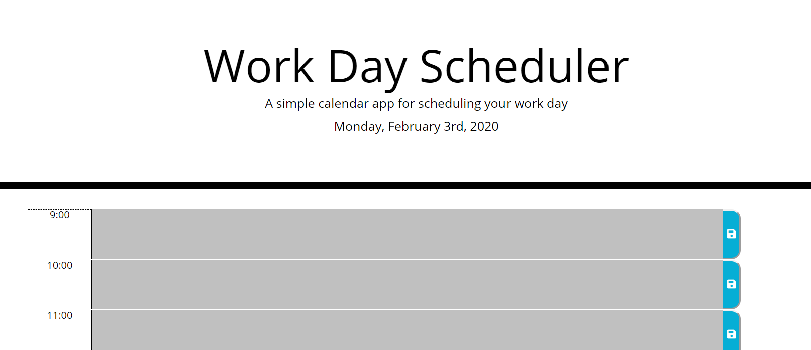
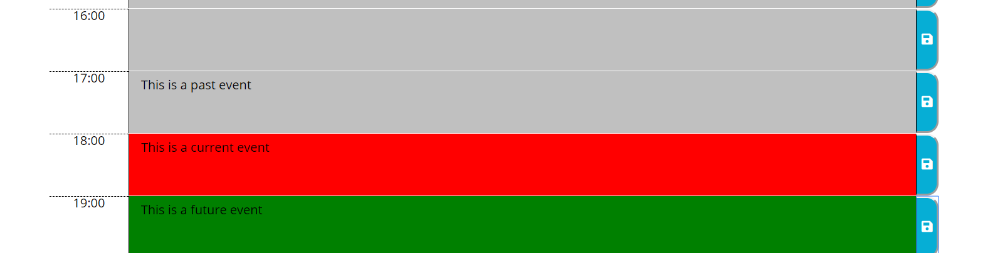

# Work Day Planner
This application will help to keep track of your workday.

## Description
The scheduler will dynamically create a 9am to 5pm work day using military time. The user can edit the text area input and save whatever task they want by pressing the save icon. The data is stored into the local storage and can be re-edited if necessary. The planner also displays the current day, along with past time blocks in silver, the current time block in red, and future time blocks in green.

### Visuals

#### Installation
No installation necessary. The program is ready to run.

https://alexjoeldelgado.github.io/WorkDayPlanner/

##### Licenses
No licenses necessary. Feel free to use my code.

###### Author
Alexander Delgado
